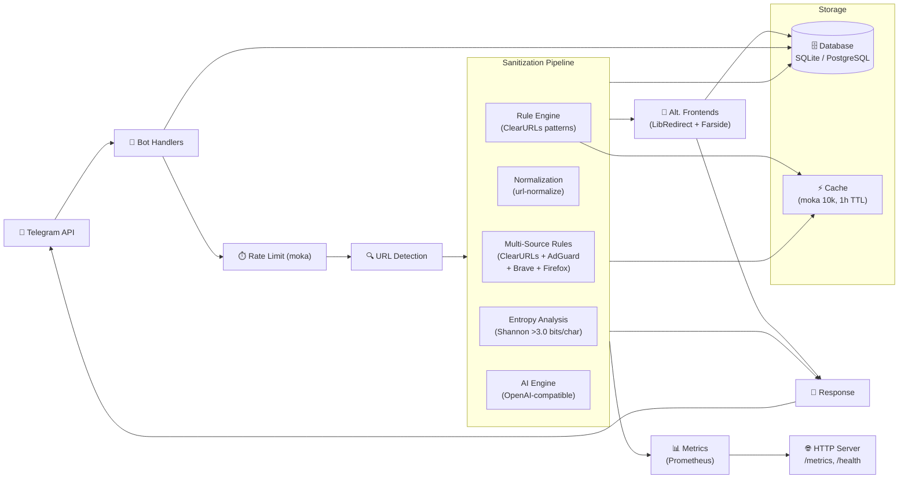

<picture></picture>

<picture>
  <source media="(prefers-color-scheme: dark)" srcset="https://img.shields.io/badge/URLCleanse-Bot-4B8BBE?style=for-the-badge&logo=telegram&logoColor=white">
  
</picture>

# URLCleanseBot

[](https://github.com/good-wine/urlcleansebot/actions/workflows/ci.yml)
[](https://github.com/good-wine/urlcleansebot/actions/workflows/docker.yml)
[](https://securityscorecards.dev/viewer/?uri=github.com/good-wine/urlcleansebot)
[](https://www.rust-lang.org)
[](LICENSE)
[](Cargo.toml)
[](https://codecov.io/gh/good-wine/urlcleansebot)

> Elimina parametri di tracciamento dagli URL nei messaggi Telegram, in tempo reale.

URLCleanseBot is a modern, high-performance Rust Telegram bot that strips tracking
parameters from shared URLs using multi-source rule engines (ClearURLs, AdGuard,
Brave, Firefox), entropy-based detection for unknown trackers, and optional
AI-powered sanitization.

## Features

- **Multi-Source Sanitization** — ClearURLs + AdGuard + Brave + Firefox rules merged via `url-sanitize-core`, with `url-normalize` canonicalization and Shannon entropy detection for unknown tracking parameters
- **AI Deep Scan** (optional) — OpenAI-compatible API for complex tracking patterns
- **Shortlink Expansion** — Follows redirects from bit.ly, tinyurl, etc.
- **Alternative Frontends** — Auto-detects YouTube, Twitter/X, Reddit, Instagram, TikTok, and 25+ other platforms; suggests privacy-respecting alternatives (Invidious, Nitter, Redlib, etc.)
- **Multi-Language** — 15 languages, auto-detected from your Telegram client
- **Inline Mode** — Clean URLs from the inline query bar
- **Group Support** — Per-chat reply/delete configuration
- **Statistics & Leaderboards** — Personal stats, domain breakdowns, top users, trending links
- **Rate Limiting & Abuse Protection** — Per-user async rate limiter (moka, 1 req/s)
- **Prometheus Metrics** — `/metrics` endpoint with Counter, Histogram, Gauge
- **OpenTelemetry Tracing** — Optional OTLP exporter for distributed tracing
- **Health Checks** — `/health` (liveness) + `/ready` (readiness + DB ping)
- **Graceful Shutdown** — CancellationToken for clean teardown
- **SSRF Protection** — DNS resolution + private IP blocking on URL expansion

## Try It

Talk to [@clearurls_bot](https://t.me/clearurls_bot) on Telegram.

## Quick Start

```bash
git clone https://github.com/good-wine/urlcleansebot.git
cd urlcleansebot
cp .env.example .env
# Edit .env: set TELOXIDE_TOKEN and BOT_USERNAME

# Run (long-polling mode)
cargo run --release

# Or run with just
just build && ./target/release/url_cleanse_bot
```

## Tech Stack

<picture>
  
</picture>
<picture>
  
</picture>
<picture>
  
</picture>
<picture>
  
</picture>
<picture>
  
</picture>
<picture>
  
</picture>
<picture>
  
</picture>
<picture>
  
</picture>
<picture>
  
</picture>
<picture>
  
</picture>
<picture>
  
</picture>
<picture>
  
</picture>
<picture>
  
</picture>
<picture>
  
</picture>

## Architecture



## Processing Pipeline

1. **Message** — Long-polling or webhook via Teloxide
2. **Rate Limit** — Per-user async check (moka future cache, 1 req/s)
3. **URL Detection** — MessageEntity + regex fallback
4. **Sanitization** — Multi-source rules → normalization → rule engine → entropy analysis → AI engine
5. **Alternative Frontends** — LibRedirect + Farside lookup
6. **Metrics** — Atomic counters for observability
7. **Persistence** — Audit logging, statistics, user preferences
8. **Response** — Formatted message with cleaned URLs

## Bot Commands

| Command | Description |
|---------|-------------|
| `/start` | Initialize the bot |
| `/help` | Show help |
| `/menu` | Quick reply keyboard |
| `/settings` | Interactive settings menu |
| `/stats` | Personal statistics |
| `/history` | Last 10 cleaned URLs |
| `/domains` | Stats grouped by domain |
| `/leaderboard` | Top 10 users |
| `/trending` | Most frequently cleaned URLs |
| `/export` | Export data as JSON |
| `/whitelist` | Manage whitelisted domains |
| `/limits` | Check rate limits |
| `/hidekbd` | Hide reply keyboard |

## Module Map

```
src/
├── lib.rs                   # Module declarations (#![deny(unused_crate_dependencies)])
├── main.rs                  # Orchestrator (~50 lines)
├── config.rs                # Environment-based configuration
├── constants.rs             # Application-wide constants
├── metrics.rs               # Prometheus counters (Counter, Histogram, Gauge)
├── http_utils.rs            # HTTP retry with exponential backoff
├── i18n/                    # Internationalization (15 languages)
│   ├── mod.rs               # Translations struct + get_translations()
│   └── it.rs, en.rs, ...    # Per-language translation modules
├── logging.rs               # Structured tracing + optional OpenTelemetry OTLP
├── presentation/telegram/   # Handlers, UI, settings, command dispatcher
│   ├── handlers/            # Bot message/callback/inline dispatch
│   │   ├── mod.rs           # run_bot(), health/metrics HTTP handlers
│   │   ├── message.rs       # handle_message, handle_edited_message
│   │   ├── inline.rs        # handle_inline_query, handle_chosen_inline_result
│   │   └── callback.rs      # handle_callback with dedup cache
│   ├── commands.rs          # Command handler functions
│   ├── command_dispatcher.rs# Trait-based command dispatch
│   ├── helpers.rs           # Keyboards, URL extraction, UI helpers
│   ├── settings.rs          # Settings callback navigation
│   └── tests.rs             # Command integration tests (stubs)
├── sanitizer/               # URL cleaning engine
│   ├── rule_engine/         # ClearURLs rule compiler + SSRF protection
│   │   ├── mod.rs           # RuleEngine struct, sanitize(), clean_url_in_place()
│   │   ├── clearurls.rs     # RawProvider, CompiledProvider parsing
│   │   ├── expand.rs        # Short URL expansion with SSRF guard
│   │   ├── redact.rs        # Sensitive data redaction (AWS keys, passwords, etc.)
│   │   ├── ssrf.rs          # Private/reserved IP detection
│   │   └── github.rs        # GitHub URL truncation
│   ├── ai_engine.rs         # Optional OpenAI-compatible API
│   ├── entropy.rs           # Shannon entropy tracker detection
│   ├── multi_source.rs      # url-sanitize-core wrapper
│   ├── normalize.rs         # URL canonicalization (url-normalize)
│   ├── pipeline.rs          # Sanitization pipeline orchestrator
│   ├── classifier.rs        # Tracking vs functional param classifier
│   ├── aggressive.rs        # Aggressive tracking parameter removal
│   ├── honor_creator.rs     # Affiliate link preservation
│   ├── linkumori.rs         # Linkumori community rules
│   └── validation.rs        # URL validation cache
├── redirects/               # Alternative frontend detection
│   ├── service.rs           # LibRedirect + Farside lookup
│   ├── models.rs            # Frontend data structures
│   └── cache.rs             # TTL-based catalog cache
├── db/                      # Database layer
│   ├── implementation.rs    # Db struct with SQL operations + DatabasePort impl
│   ├── models.rs            # UserConfig, ChatConfig, CleanedLink, CustomRule
│   └── migrations/          # SQL migration files
├── shared/                  # Cross-cutting concerns
│   ├── error.rs             # AppError, AppResult
│   ├── security.rs          # Rate limiter, input sanitization, HMAC
│   └── ports/               # Trait interfaces for testability
│       ├── database.rs      # DatabasePort trait (+ MockDatabasePort)
│       ├── sanitizer.rs     # SanitizerService trait (+ MockSanitizerService)
│       ├── ai.rs            # AiProvider trait (+ MockAiProvider)
│       └── redirect.rs      # RedirectProvider trait (+ MockRedirectProvider)
├── presentation/            # (reserved for future UI layers)
└── config/                  # (reserved for future config profiles)
```

## Documentation

| Document | Description |
|----------|-------------|
| [ARCHITECTURE.md](docs/ARCHITECTURE.md) | Architecture deep dive |
| [DEPLOYMENT.md](docs/DEPLOYMENT.md) | Deployment guide (Docker, Render, native) |
| [CONTRIBUTING.md](CONTRIBUTING.md) | Contributing guide |
| [SECURITY.md](SECURITY.md) | Security policy |
| [CHANGELOG.md](CHANGELOG.md) | Release history |
| [LANGUAGES.md](LANGUAGES.md) | Supported languages & translation guide |
| [SUPPORT.md](SUPPORT.md) | Getting help |

## Environment Variables

| Variable | Required | Default | Description |
|----------|----------|---------|-------------|
| `TELOXIDE_TOKEN` | Yes | — | Telegram bot token |
| `BOT_USERNAME` | Yes | — | Bot username |
| `ADMIN_ID` | No | `0` | Admin Telegram user ID |
| `DATABASE_URL` | No | `sqlite:bot.db` | SQLite/PostgreSQL connection |
| `PORT` | No | `8080` | HTTP server port |
| `SERVER_ADDR` | No | `0.0.0.0:{PORT}` | Bind address |
| `CLEARURLS_SOURCE` | No | official | ClearURLs rules URL |
| `LIBREDIRECT_URL` | No | official | LibRedirect catalog URL |
| `FARSIDE_URL` | No | official | Farside catalog URL |
| `AI_API_KEY` | No | — | OpenAI-compatible API key |
| `AI_API_BASE` | No | `https://api.openai.com/v1` | AI API base URL |
| `AI_MODEL` | No | `gpt-3.5-turbo` | AI model name |
| `INLINE_MAX_RESULTS` | No | `5` | Max inline results |
| `WEBHOOK_URL` | No | — | Public HTTPS URL for webhook |
| `WEBHOOK_SECRET` | Conditional | — | Required with `WEBHOOK_URL` |
| `URL_SANITIZE_CATALOG` | No | default | Multi-source catalog URL |

## Development

```bash
# Quick start with just
just setup     # install tooling + git hooks
just check     # fast compilation check
just fix       # auto-fix clippy + format
just test      # run all tests
just ci        # full CI pipeline locally
```

```bash
# Manual
cargo check --locked --all-targets
cargo fmt --all
cargo clippy --all-targets -- -D warnings
cargo test
```

See [CONTRIBUTING.md](CONTRIBUTING.md) for detailed development workflows.

## Related Projects

- [ClearURLs](https://clearurls.xyz/) — Browser extension that inspired this bot
- [url-sanitize](https://github.com/jacob-pro/url-sanitize) — Multi-source URL sanitization library
- [LibRedirect](https://libredirect.github.io/) — Privacy-friendly frontend redirector
- [Farside](https://farside.link/) — Automatic redirect to working frontend instances
- [url-normalize](https://github.com/jacob-pro/url-normalize) — URL canonicalization library

## Support

- Open an [issue](https://github.com/good-wine/urlcleansebot/issues/new/choose)
- See [SUPPORT.md](SUPPORT.md)

## License

MIT — see [LICENSE](LICENSE).

---

<picture>
  <source media="(prefers-color-scheme: dark)" srcset="https://api.star-history.com/svg?repos=good-wine/urlcleansebot&type=Date&theme=dark">
  
</picture>
